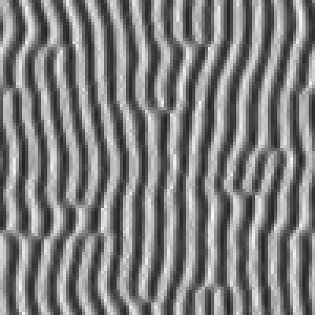
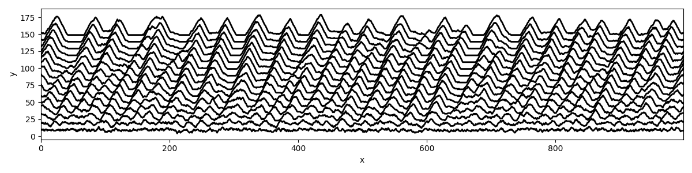

## Ripple Model

A simple coupled map lattice (CML) model for the formation dynamics of ripples by wind-blown sand, based on the model by Nishimori and Ouchi (1992).

The model incorporates the elementary sand transport processes of grain saltation (i.e. 'downwind' transport) and surface creep (i.e. diffusion) in a nonlinear reaction-diffusion-type process represented on a lattice grid.

In Python with Pillow and Matplotlib.

## dune-model

A cellular automaton model simulating the formation and evolution of dunes by wind-blown sand, based on the model by Werner (1995).

Dunes are built from piled "slabs" representing sand on a one- or two-dimensional lattice, whose edges are connected with periodic boundary conditions. The number of sand slabs is proportional to the surface height, and their movement comprises one-directional transport together with avalanching dynamics enforced by an angle of repose stability condition. Slabs are preferentially depsited in "shadow zones" in the lee of dunes.

In Werner's treatment, the simulated dune fields are interpreted as complex systems, with dune types being dynamical attractors of these systems.

Note that running the model in 2-d takes some time. Maybe next time I'll build it in Rust.
